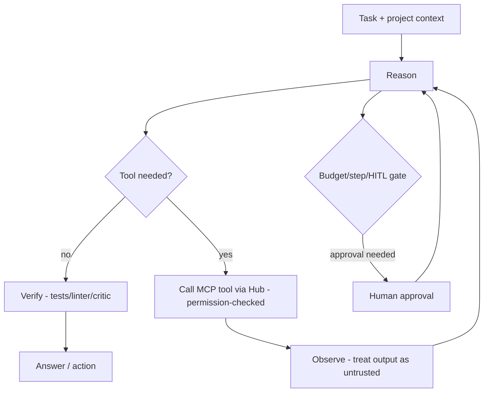
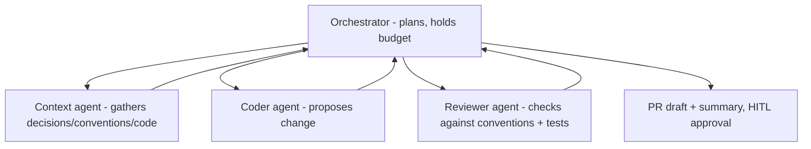

# ContextOS — AGENT DESIGN

Agent architecture for ContextOS. See AGENT_GUIDE.md for general patterns. Principle: **prefer governed workflows; use agents only where dynamic reasoning is required.**

## 1. Single-agent architecture

The base unit: a context-aware agent that loads team context, uses MCP tools, and is sandboxed/budgeted/traced.

Every ContextOS agent gets: team context preloaded, least-privilege MCP tools, max-steps + token/$ budget, trajectory tracing, guardrails, and HITL gates on risky actions.

## 2. Multi-agent architecture

Hierarchical orchestrator → specialists, used for complex flows (e.g., "implement this issue using our conventions"):

Roles: **Orchestrator/Planner** (decompose, delegate, integrate, own budget), **Context agent** (retrieve curated + code context), **Coder** (generate), **Reviewer/Critic** (validate vs. conventions + run tests). Reserve multi-agent for tasks a single agent's context can't handle cleanly.

## 3. Agent communication
- **Shared state** in Postgres/Redis (blackboard) — observable, default.
- **Structured handoffs**: typed payload + only the relevant context slice (not full history).
- **Agents-as-tools**: an agent can be exposed to the orchestrator as an MCP tool for clean boundaries.

## 4. Common ContextOS agents (V2+)
| Agent | Job | Autonomy |
|-------|-----|----------|
| Onboarding agent | Orient a new dev/agent from team context | Low (read-only) |
| Doc-keeper | Update living docs when code changes | Medium (HITL on publish) |
| PR-context reviewer | Comment if a PR violates conventions/decisions | Low-Medium (suggest only) |
| Memory extractor | Propose decisions/conventions from PRs/chats | Low (human approves) |
| Codebase Q&A agent | Multi-hop questions over the codebase | Low (read-only) |

## 5. Reliability & guardrails
- Workflows for deterministic paths; agents only where needed.
- Budgets (steps/tokens/$), loop detection, timeouts.
- Tool least-privilege via the Hub; HITL on destructive/expensive/irreversible actions.
- Sandboxed execution (no ambient FS/network) for any code-running tool.
- Full trajectory tracing + failure taxonomy (reuses Agent Monitoring #4).
- Tool outputs treated as untrusted (prompt-injection defense).

## 6. Frameworks
Own thin orchestration by default; **LangGraph** (TS or Python sidecar) for stateful multi-agent graphs; **Claude Agent SDK** for Claude-native flows; **CrewAI** if role-crews prototype faster. Kept behind our interfaces for swappability.
