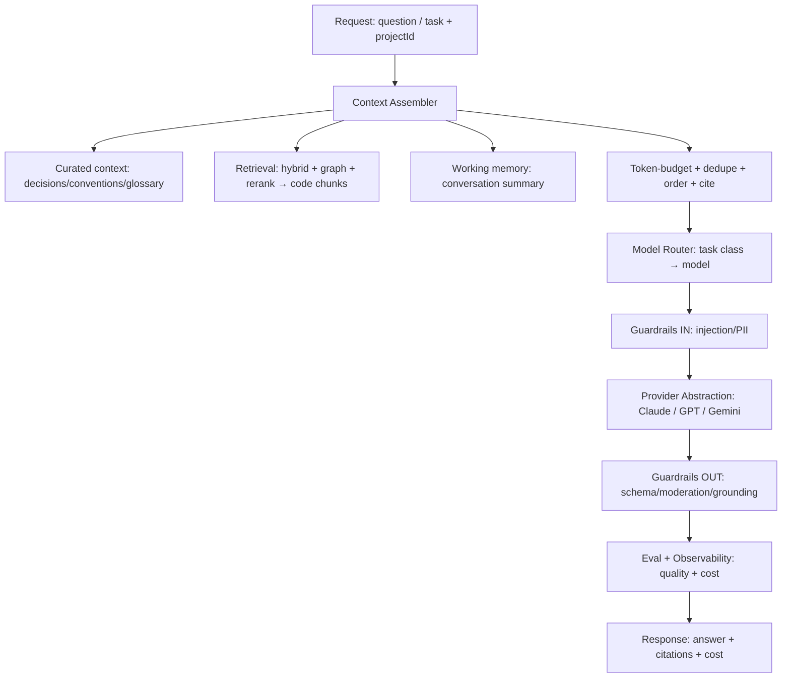

# ContextOS — AI ARCHITECTURE

> The complete AI system: models, embeddings, retrieval, memory, tool calling, agents, evaluation, cost architecture — plus the strategic AI decisions (train vs. fine-tune vs. RAG vs. agents, model selection, cost/tradeoff comparisons). Builds on AI_STACK_GUIDE.md, [RAG.md](./RAG.md), [AGENT_DESIGN.md](./AGENT_DESIGN.md).

## 1. Executive Summary

ContextOS is an **AI product, not an AI research lab.** We compose frontier LLM APIs, retrieval, tools, orchestration, guardrails, and evals into a reliable system; we do **not** train or pre-train models, and we defer fine-tuning for years (DECISION_LOG.md D-001). The AI architecture is organized as a pipeline behind the Orchestration plane: a **Context Assembler** budgets what enters the model's context window (curated context + retrieved code chunks + working memory); a **Model Router** selects the cheapest adequate model per task class; a **Provider Abstraction** (Claude default, GPT/Gemini swappable) executes the call with prompt caching; **Guardrails** filter input and output; and an **Eval + Observability** layer measures quality and cost on every call. Memory is three-tier (working/curated/derived). Tool use is via MCP. Agents are used sparingly, only where dynamic reasoning is required, and always sandboxed, budgeted, traced, and guardrailed.

The architecture exists to deliver three properties: **grounded correctness** (answers come from retrieved context with citations, or the system says "I don't know"), **bounded cost** (every call is routed, cached, metered, and capped to protect a 70%+ gross margin), and **measured quality** (a golden-dataset eval harness runs in CI so prompt/model/retrieval changes cannot silently regress). This document covers each layer in implementation detail, then answers the strategic AI questions every reviewer asks — should we train, fine-tune, use RAG, use MCP, use agents, which models, and at what cost — with explicit comparisons.

---

## 2. The AI Pipeline



Every stage is instrumented (OpenTelemetry) and cost-attributed. The Orchestration plane is the **only** component that calls a provider — centralizing routing, caching, guardrails, and observability.

---

## 3. Models & Model Routing

**Default model: Claude**, accessed through a provider abstraction so no product code is bound to a vendor SDK (D-003). Routing selects by **task class**, not by habit:

| Task class | Example | Model (default) | Why |
|------------|---------|-----------------|-----|
| Reasoning / agents / code gen | "implement this change," multi-hop Q&A | **Claude Opus 4.x** | Leads on coding/agentic/tool-use; long context |
| Standard Q&A / summaries | "how does auth work?" | **Claude Sonnet** | Strong quality at far lower cost |
| Bulk / cheap / fast | classification, extraction, short drafts, memory extraction | **Claude Haiku** | Cheapest; high volume |
| Massive context dumps | whole-file or large-context tasks | largest cost-effective window | minimize chunking loss |

Routing is **policy-aware** (an org's `policies` may restrict allowed models) and **budget-aware** (a request near a spend cap is downgraded or queued). Temperature is low for code/structured tasks; structured output uses JSON mode / tool schemas validated by Zod.

### Provider abstraction
```ts
interface LLMProvider {
  complete(req): Promise<Result>;
  stream(req): AsyncIterable<Chunk>;
  withTools(tools): LLMProvider;
  embed(input: string[]): Promise<number[][]>;
}
// ClaudeProvider | OpenAIProvider | GeminiProvider, behind a Router
```
Benefits: swap providers, route by cost/capability, centralize retries/timeouts/caching/observability, and **fail over** if a provider has an outage. Lives in shared `packages/llm`.

---

## 4. Embeddings

- Provider-abstracted embedding model, 1536-dim, stored in pgvector ([DATABASE.md](./DATABASE.md)).
- **Dual embedding for code:** each code chunk is embedded twice — the raw code *and* an LLM-generated natural-language summary ("what this function does"). English queries match the summary; identifier queries match code/lexical. This is the single biggest retrieval-quality lever after AST chunking.
- **Content-hash cache:** re-embed only changed chunks (skip unchanged by hash) → cheap incremental reindex.
- **Versioned embeddings:** an embedding-model upgrade uses a new version column/table with dual-read during migration (re-embedding a large corpus is expensive and must be online).

---

## 5. Retrieval (summary; full detail in [RAG.md](./RAG.md))

Hybrid + graph + rerank: **vector** (HNSW cosine) catches meaning, **lexical** (Postgres FTS + trigram) catches identifiers/error strings, fused via reciprocal rank fusion; **symbol-graph expansion** pulls callers/callees of matched symbols for cross-file reasoning; a **re-ranker** (cross-encoder or LLM scoring) reorders ~30–50 candidates to the top 5–10 within the token budget; the assembler adds file:line headers for citations. Tenant+project scoping is mandatory on every query. See RAG_GUIDE.md and codebase-intelligence/RAG.md (the reused engine).

---

## 6. Memory Architecture

| Tier | What | Store | Lifecycle |
|------|------|-------|-----------|
| **Working** | Current conversation / agent step | Redis + in-request | ephemeral; summarized when long |
| **Curated long-term** | Decisions, conventions, glossary, ADRs | Postgres `context_items` (versioned) | human/agent authored + reviewed |
| **Derived long-term** | Code/doc understanding | pgvector `chunks`/`embeddings` | regenerated on push |

- **Memory extraction:** workers parse PRs/commits/chat sessions to *propose* new decisions/conventions → human/agent review → stored as curated context. This is how the system "remembers" corrections (the Context Handoff value).
- **Summarization:** long conversations are summarized to fit the window; old detail is offloaded to retrievable memory rather than carried in-context (context bloat is the top cause of cost/latency/quality decay).
- **Context Assembler budget:** curated context (highest priority) + top retrieved chunks + working-memory summary, deduped and ordered, within a hard token budget that leaves room for the answer.

---

## 7. Tool Calling & Agents (summary)

Tools are exposed via **MCP** ([MCP.md](./MCP.md)): typed, validated, least-privilege, observable; the Integration Hub enforces permissions/rate limits and audits every call; tool *outputs* are treated as untrusted (injection defense). **Agents** ([AGENT_DESIGN.md](./AGENT_DESIGN.md)) run single- or multi-agent flows with team context loaded, sandboxed, budgeted (max steps/tokens/$/time), traced (full trajectory), and guardrailed (HITL on risky actions). Default stance: **workflows over agents** for reliability.

---

## 8. Evaluation (quality is engineered, not hoped)

- **Golden datasets** per capability: codebase Q&A (questions + verified answers + expected citations), memory extraction, agent tasks (success criteria).
- **Metrics:** faithfulness/groundedness, citation correctness, answer relevance, retrieval recall@k/precision@k, agent task-success rate, latency, **cost-per-task**.
- **LLM-as-judge** for subjective metrics (faithfulness/relevance); **deterministic checks** for citations (do cited lines exist and support the claim?) and schemas.
- **In CI:** every prompt/model/chunking change runs the eval suite; regressions block merge (`pnpm test:eval`).
- **Live:** sample production traffic into the eval pipeline; user feedback (thumbs/notes) grows the golden dataset over time.
- Reuses shared `packages/evals` (also the product core of Agent Monitoring #4).

---

## 9. Cost Architecture (COGS is an engineering concern)

LLM tokens are the dominant variable cost; protecting a 70%+ gross margin is an architectural mandate, not a finance afterthought. Levers, in order of impact:
1. **Retrieve less, better** — 5 great chunks beat 50 mediocre ones (cost *and* accuracy).
2. **Prompt caching** — cache the stable system-prompt prefix + large curated context (Anthropic cache ~5-min TTL); major savings for repeated calls.
3. **Model routing** — never use Opus for a classification task (§3).
4. **Answer caching** — deterministic cache key (repo SHA + question) returns cached answers.
5. **Output discipline** — concise/structured output, `max_tokens` caps.
6. **Batching & async** — batch embeddings; stream for perceived latency.
7. **Spend caps & alerts** — per-tenant budgets enforced pre-call; graceful degradation at cap.

Every request records `cost_usd`, tokens, model, and cache-hit to `usage_records`; cost-per-task is a tracked **product** metric, surfaced in dashboards ([OBSERVABILITY.md](./OBSERVABILITY.md)).

---

## 10. Strategic AI Decisions (the questions every reviewer asks)

### 10.1 Should we train our own model? — **No.** When?
Not in the first 2–3 years (D-001). Pre-training a frontier model costs tens to hundreds of millions, requires a research org we don't have, and competes at the layer where our edge is *zero*. The model is a rented, rapidly-improving, deflating commodity; our moat is **context, workflow, integration, governance, and data**. We would only revisit training (more realistically a small specialized model) when *all* of: (a) we hold a large proprietary, opt-in dataset (e.g., labeled context-retrieval interactions), (b) inference cost exceeds ~30% of revenue, and (c) a measurable quality/latency gap exists that a custom model would close. Even then, the first step is fine-tuning or distillation, not pre-training.

### 10.2 Should we fine-tune? — **Not yet; later, narrowly.**
Fine-tuning is deferred until we have significant proprietary data and a proven retention curve (D-001). Premature fine-tuning bakes in today's behavior, is expensive to maintain across model upgrades, and rarely beats good RAG + prompting for knowledge tasks. The likely *first* fine-tune candidates (Year 2–3, if at all) are narrow, high-volume, cost-sensitive paths — e.g., a small model for memory-extraction or query-rewriting — pursued via fine-tuning or **distillation** of a frontier model's behavior, only with explicit customer opt-in for any data use (D-010).

### 10.3 Should we use RAG? — **Yes, centrally.**
RAG is the backbone. It is cheaper than fine-tuning for knowledge, updatable in real time (re-index on push), attributable (citations), and avoids hallucination by grounding. ContextOS's correctness *is* its RAG quality. See [RAG.md](./RAG.md).

### 10.4 Should we use MCP? — **Yes.**
MCP is how we integrate tools/data in a standardized, governed way, and how we expose ContextOS to any AI tool. It rides a fast-adopting open standard and avoids M×N bespoke integrations. See [MCP.md](./MCP.md).

### 10.5 Should we use agents? Workflows? When to avoid agents?
- **Use workflows by default** — deterministic chained LLM calls + tools — wherever the path is known. They are reliable, debuggable, cheap, and predictable.
- **Use agents only** where the next step genuinely depends on dynamic context (multi-hop investigation, "implement this issue"). Always sandboxed, budgeted, traced, HITL-gated.
- **Avoid agents** on critical, irreversible, or cost-sensitive paths; when a workflow suffices; when you can't bound cost/steps; or when failure isn't gracefully recoverable. Most "agent" features are 80% workflow + 20% agentic loop. See [AGENT_DESIGN.md](./AGENT_DESIGN.md).

### 10.6 Which models? — Claude default; GPT/Gemini swappable; open-weight later.
| Provider | Strengths (for us) | Use |
|----------|--------------------|-----|
| **Claude (default)** | Best coding/agentic/tool-use; long context; strong safety | Reasoning, agents, code, default everywhere |
| **GPT** | Strong general reasoning, ecosystem, structured output | Fallback/failover; specific tasks; provider diversity |
| **Gemini** | Very large context windows, competitive cost | Massive-context tasks; cost arbitrage |
| **Open-weight (Llama/Qwen/etc.)** | Self-hostable, cheapest at volume, data control | *Future*: cheapest high-volume paths only if D-001 revisit conditions met; ops burden today |

We default to Claude and keep GPT/Gemini swappable per task behind the abstraction (D-003), reviewed quarterly as models/prices move.

### 10.7 Cost comparison (illustrative, order-of-magnitude)
Frontier "reasoning" tier models cost roughly an order of magnitude more per token than "fast/cheap" tier models from the same vendor; open-weight self-hosting trades per-token cost for fixed GPU + ops cost (only economical at sustained high volume). The architectural implication is unchanged regardless of exact 2026 prices: **route aggressively, cache aggressively, retrieve leanly.** Exact per-model prices are tracked in the quarterly model review (not hard-coded here, because they change monthly).

### 10.8 Tradeoff comparison (RAG vs. fine-tune vs. long-context vs. agents)
| Approach | Best for | Cost | Freshness | Attribution | Our use |
|----------|----------|------|-----------|-------------|---------|
| **RAG** | private/changing knowledge | low–med | real-time | yes (citations) | **primary** |
| **Fine-tune** | stable style/format at volume | high upfront | stale (retrain) | no | deferred (D-001) |
| **Long-context (stuff it all in)** | small corpora, one-off | high per-call | real-time | weak | only for small/whole-file tasks |
| **Agents** | dynamic multi-step tasks | high, variable | n/a | trajectory | sparing, guarded |

---

## 11. Failure Modes & Fallbacks
- **Provider outage** → router fails over to an alternate provider.
- **Empty/low-confidence retrieval** → "I don't know" + suggest where to add context (never hallucinate).
- **Tool error** → structured, recoverable error the model can adapt to; HITL escalation for risky steps.
- **Budget/step exceeded** → graceful stop + hand back to human.
- **Eval regression in CI** → block the change.

## 12. Tradeoffs, Risks, Alternatives
- **Abstraction vs. provider-specific features:** the abstraction may lag a vendor's newest capability; mitigated by capability flags. The independence + cost routing is worth it.
- **RAG complexity vs. long-context simplicity:** stuffing everything into a huge window is simpler but costlier and weaker on attribution; RAG wins at repo scale.
- **Risk — hallucination erodes trust:** mitigated by grounding, citations, "I don't know," self-check, and CI evals.
- **Risk — COGS creep:** mitigated by the §9 levers; cost-per-task is monitored with anomaly alerts.
- **Alternative rejected — train/fine-tune early:** premature, capital-intensive, off-strategy (D-001).

## 13. Future Considerations
Edge/regional prompt caching; cost/latency/quality-aware routing as a tunable product surface; a small distilled model for the cheapest high-volume internal tasks (post-revisit); agentic RAG for hard multi-hop questions; continuous online evals with auto-rollback on quality regression.

## 14. Related Documents
AI_STACK_GUIDE.md · [RAG.md](./RAG.md) · [MCP.md](./MCP.md) · [AGENT_DESIGN.md](./AGENT_DESIGN.md) · [ARCHITECTURE.md](./ARCHITECTURE.md) · [OBSERVABILITY.md](./OBSERVABILITY.md) · [GUARDRAILS.md](./GUARDRAILS.md) · DECISION_LOG.md

*Last reviewed 2026-06-19.*
