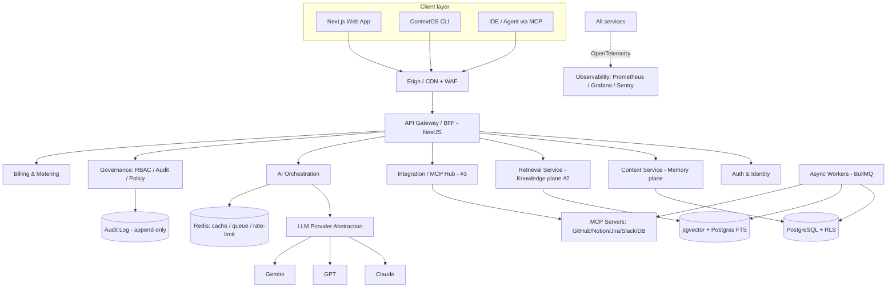
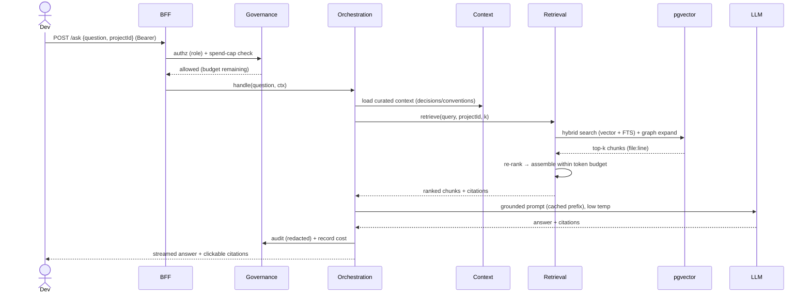
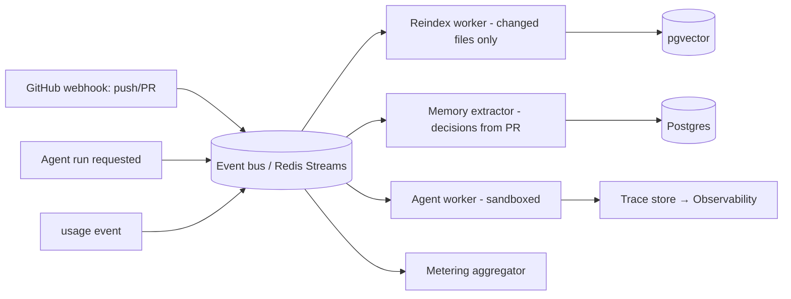
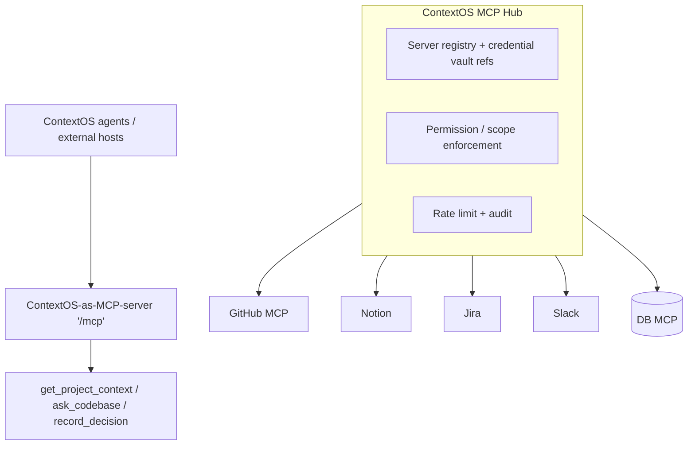
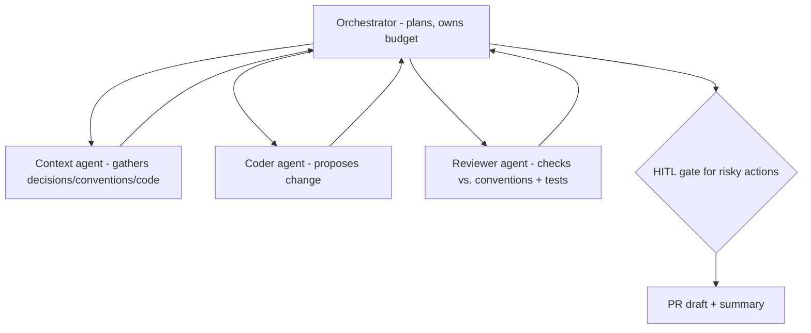
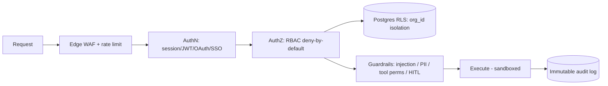

# ContextOS — ARCHITECTURE

> Implementation-grade architecture. A competent engineer should be able to build ContextOS from this document plus [DATABASE.md](./DATABASE.md), [API_DESIGN.md](./API_DESIGN.md), and [AI_ARCHITECTURE.md](./AI_ARCHITECTURE.md). Diagrams are Mermaid (render in GitHub).

## 1. Executive Summary

ContextOS is a **multi-tenant SaaS** with a **thin local layer** (CLI + an MCP server) that integrates with developers' existing AI tools. Architecturally it is a **modular monolith first, services later** (decision D-009): a single deployable NestJS application with hard module boundaries and a set of asynchronous workers, evolving into independently scaled services only when load, team size, or enterprise/VPC requirements demand it. The system is organized into five logical planes — **Memory, Knowledge, Integration, Orchestration, Control** — backed by **PostgreSQL + pgvector** (single primary datastore, D-004), **Redis** (cache, rate limiting, queues), and **frontier LLM APIs** behind a provider-abstraction layer (D-003). Everything is **tenant-scoped** (`org_id` + Postgres Row-Level Security), **observable** (OpenTelemetry traces with cost attribution on every AI call), and **governed** (RBAC, audit, guardrails, spend caps).

The architecture is designed around three non-negotiable properties: (1) **correctness through grounding** — AI answers are retrieval-grounded and cited, never free-floating; (2) **tenant isolation as an invariant** — no query may cross `org_id`; (3) **cost as a first-class signal** — every LLM/tool call is metered, routed, cached, and capped. This document covers the system, component, service-boundary, data-flow, event-flow, queue, MCP, multi-agent, and security architectures, then projects how the architecture must change across five orders of magnitude of scale (10 → 100,000 users).

---

## 2. System Architecture (high level)

The diagram shows the *logical* architecture. Physically, in the MVP, `AUTH/CTX/RET/INT/ORCH/GOV/BILL` are **modules inside one NestJS app**; `WORKERS` is a second deployable; `PG/VEC/REDIS` are managed services. The split into independent services happens at the scale tiers in §11.

---

## 3. Component Architecture

| Component | Responsibility | Key tech | Extracted as a service at |
|-----------|----------------|----------|---------------------------|
| **Web App** | UI: dashboards, chat, context editor, guardrails console | Next.js (App Router), React, Tailwind, shadcn/ui | always separate (Vercel/edge) |
| **API Gateway / BFF** | AuthN, routing, request shaping, rate limiting, request-scoped tenant context | NestJS | n/a (the monolith) |
| **Auth & Identity** | Sessions, OAuth, API keys, SSO/SAML/SCIM (V3) | NestJS + Auth.js/WorkOS | Tier 3 |
| **Context Service (Memory)** | CRUD + versioning of decisions/ADRs/conventions/glossary; Context Handoff bundles | NestJS + Postgres | Tier 4 |
| **Retrieval Service (Knowledge)** | Ingest/chunk/embed code+docs; hybrid retrieval + graph + rerank (the #2 engine) | NestJS + pgvector + tree-sitter | **Tier 2 (first to split)** |
| **Integration / MCP Hub** | Connect/manage MCP servers; auth/permission/observe tool calls (the #3 engine) | NestJS + MCP SDK | Tier 3 |
| **AI Orchestration** | Compose prompts, RAG, tools, agents; model routing; caching; the only LLM caller | NestJS + LLM abstraction | Tier 3 |
| **Governance** | RBAC, audit log, policy engine, guardrails config, spend caps | NestJS + Postgres | stays central |
| **Billing & Metering** | Plans, usage metering, Stripe | NestJS + Stripe | Tier 3 |
| **Workers** | Async: indexing, embedding, memory extraction, agent runs, reports | BullMQ on Redis | **Tier 1 (always separate deployable)** |

### Service boundaries (why these seams)
- **Context vs. Retrieval.** Context is *curated, human/agent-authored* knowledge (decisions, conventions) with a slow write path and high trust. Retrieval is *derived, mechanical* understanding of code with a heavy write (indexing) path. Different lifecycles, different scaling — clean seam, and it lets Retrieval ship as standalone #2.
- **Integration Hub isolation.** Untrusted tool I/O (prompt-injection surface) is contained here; it also ships as standalone #3.
- **Orchestration as the only LLM caller.** Centralizing all model access in one component gives one place for cost control, caching, routing, observability, and guardrails. Nothing else calls a provider SDK.
- **Governance is cross-cutting but centralized** so RBAC/audit/policy aren't duplicated or drifting.

---

## 4. Data Flow — "Ask about the codebase" (read path)

Key properties: governance gates *before* spend; retrieval is tenant+project scoped; the system prompt prefix is **prompt-cached**; every call is **audited and costed**; the answer must cite or say "I don't know."

---

## 5. Event-Driven Architecture & Queue Design

ContextOS is event-driven for everything that is slow, bursty, or asynchronous (indexing, embedding, memory extraction, agent runs, report generation, webhook handling). The write path that mutates derived knowledge is *always* async.

### Canonical events
`repo.pushed`, `pr.opened`, `context.updated`, `context.proposed`, `agent.run.requested|step|completed|failed`, `integration.connected`, `billing.usage`, `index.completed`, `doc.drift.detected`.

### Queue architecture (Redis + BullMQ)
- **Queues by workload class:** `indexing` (CPU/IO-heavy, autoscaled), `embedding` (LLM-cost-bearing, batched), `memory` (LLM, low volume), `agents` (sandboxed, budgeted), `reports`, `webhooks` (fast, high fan-in).
- **Guarantees:** at-least-once delivery; **idempotency keys** on every job (jobs may retry); dead-letter queues (DLQ) per queue with alerting.
- **Backpressure:** queue depth is an autoscaling signal and a health metric; webhook intake is decoupled from processing so a spike never drops events.
- **Ordering:** per-tenant, per-resource ordering where it matters (e.g., reindex jobs for the same repo are serialized by `repo_id`).
- **Migration path:** Redis Streams/BullMQ is sufficient to mid-scale; a managed broker (e.g., SQS/PubSub or Kafka) is introduced at Tier 4 when multi-service fan-out and replay demand it (§11).

---

## 6. AI Architecture (summary; full detail in [AI_ARCHITECTURE.md](./AI_ARCHITECTURE.md))

The Orchestration plane composes: **Context Assembler** (curated context + retrieved chunks + working memory, within a token budget) → **Model Router** (task class → model: Opus for reasoning/agents, Sonnet/Haiku for cheap/fast) → **LLM Provider Abstraction** (Claude default; GPT/Gemini swappable) → **Guardrails** (input/output filters) → **Eval/Observability** (cost + quality). Memory is three-tier: working (Redis), curated long-term (Postgres `context_items`), derived long-term (pgvector). See [AI_ARCHITECTURE.md](./AI_ARCHITECTURE.md) and [RAG.md](./RAG.md).

---

## 7. MCP Architecture

ContextOS is **both an MCP host** (it connects to external MCP servers via the Hub, with central auth/permission/observability) **and an MCP server** (it exposes the org's context — `get_project_context`, `ask_codebase`, `search_code`, `record_decision`, and a `/load-context` prompt — so *any* MCP-aware tool/agent can use ContextOS). Tool *outputs* are treated as untrusted (injection defense). Full detail in [MCP.md](./MCP.md).

---

## 8. Multi-Agent Architecture

ContextOS prefers **governed workflows** and uses agents only where dynamic reasoning is required. The agent runtime is **sandboxed, budgeted, traced, and guardrailed**, with the team context preloaded.

Communication is via **shared state (Postgres/Redis blackboard)** and **structured handoffs** (typed payload + only the relevant context slice). Agents can be exposed to one another *as MCP tools* for clean boundaries. Full detail in [AGENT_DESIGN.md](./AGENT_DESIGN.md).

---

## 9. Security Architecture (summary; full detail in [SECURITY.md](./SECURITY.md))

Invariants: **tenant isolation** (`org_id` + RLS, enforced at the DB), **least privilege** (RBAC + scoped integration permissions), **secrets in a vault** (never in DB/context/logs), **encryption** in transit and at rest with per-tenant keys for Enterprise, and **customer code never trains any model** (D-010). The top AI-specific threat is prompt injection via connected repos/tools; mitigations are in [GUARDRAILS.md](./GUARDRAILS.md).

---

## 10. Non-Functional Requirements (SLOs)

| NFR | Target |
|-----|--------|
| Answer first-token latency | < 1.5 s |
| Answer full latency p95 | < 4 s |
| Index a 100k-LOC repo | < 10 min (incremental reindex < 1 min for small pushes) |
| Availability | 99.9% (V3 contractual SLA) |
| Tenant isolation | 100% — zero cross-tenant access (tested invariant) |
| Cost attribution | 100% of LLM/tool calls metered |
| Gross margin | > 70% at scale |
| Graceful degradation | survive single LLM-provider outage via failover |

---

## 11. Scale Projections — How the Architecture Changes (10 → 100,000 users)

This is the heart of the document: the same logical architecture, evolved across five orders of magnitude. "Users" ≈ active developers; assume ~5–15 developers per paying org.

### Tier 0 — 10 users (design partners / pre-PMF)
- **Shape:** Single NestJS app (modular monolith) + one worker process, on a managed PaaS (Railway/Render/Fly). One managed Postgres (Neon/Supabase) with pgvector. One Redis. Web on Vercel.
- **Data:** Single shared schema, `org_id` + RLS. A few repos, ≤ a few hundred thousand chunks.
- **AI:** Direct provider calls behind the abstraction; prompt caching; mostly Sonnet/Haiku.
- **Bottleneck:** none technical — the bottleneck is product/PMF. **Do not over-engineer.** No K8s, no microservices, no dedicated vector DB.
- **Cost:** tens of dollars/month infra + metered LLM. Founder operates everything.

### Tier 1 — 100 users (early traction, first paid teams)
- **Shape:** Same monolith, but **workers scaled horizontally** and split by queue class (indexing/embedding/agents). Add a read replica for Postgres. CDN/WAF at the edge.
- **Data:** Millions of chunks; HNSW index tuning matters; introduce **content-hash caching** so reindex only re-embeds changed files. Partition `audit_logs`/`usage_records`/`events` by month.
- **AI:** Aggressive prompt + answer caching; model routing matters for margin; per-tenant spend caps live.
- **Bottlenecks:** embedding cost and indexing throughput. **Change:** dedicated autoscaling worker pool for indexing/embedding; batch embeddings.
- **Ops:** basic dashboards + alerts (latency, errors, cost anomaly, queue depth). Still no K8s.

### Tier 2 — 1,000 users (scaling, Team plan is the revenue core)
- **Shape:** **Extract the Retrieval Service** (the heaviest, most independently scalable component) from the monolith into its own deployable. Orchestration, Context, Integration, Governance remain together. Introduce a managed message broker alongside Redis for cross-service events.
- **Data:** Vectors partitioned by tenant; consider per-large-tenant index isolation. Postgres vertically scaled + multiple read replicas; connection pooling (PgBouncer). Hot time-series (usage/audit/events) on monthly partitions with retention jobs.
- **AI:** Semantic + answer caches with high hit rates; routing tuned; evals run in CI to protect quality at scale; a small Python sidecar for any best-in-class parsing/eval tooling.
- **Bottlenecks:** Postgres write/IO under indexing load; vector query p95 under large tenants. **Change:** separate the OLTP Postgres from the vector workload if pgvector latency breaches SLO (still pgvector, but its own instance) — or begin evaluating a dedicated vector store (D-004 revisit threshold).
- **Ops:** on-call rotation forming; SOC 2 Type I process; canary deploys.

### Tier 3 — 10,000 users (growth, enterprise pilots)
- **Shape:** **Microservices for the heavy/independent planes** — Retrieval, Orchestration, Integration Hub, and Workers are independent services; Governance + Billing + Context remain a core service. **Introduce Kubernetes** (the ops tax is now justified) with HPA on CPU + queue depth + request rate. GitOps (Argo/Flux) for cluster state; Terraform for infra.
- **Data:** Postgres sharded or split by domain (OLTP vs. vector vs. time-series → likely a columnar store like ClickHouse for events/usage/audit analytics). Dedicated vector store if pgvector is past its comfort zone for the largest tenants. Multi-region read paths begin.
- **AI:** Centralized model-routing service with cost-based routing and provider failover; prompt-cache and answer-cache as shared services; per-tenant model/budget policies enforced by the policy engine.
- **Enterprise:** SSO/SAML/SCIM; single-tenant data isolation option (schema- or DB-per-tenant) for the largest customers; **VPC/on-prem deployment** path (Helm chart) for security-sensitive buyers.
- **Bottlenecks:** cross-service latency, distributed tracing complexity, and cost governance at fleet scale. **Change:** service mesh / robust OTel tracing; tail-based sampling; FinOps dashboards per tenant.
- **Ops:** SOC 2 Type II; multi-AZ HA; tested DR (PITR + restore drills); error-budget policy.

### Tier 4 — 100,000 users (platform scale)
- **Shape:** Fully service-oriented, multi-region, Kubernetes-native. Retrieval and Orchestration scaled independently and regionally; the MCP Hub is a fleet handling untrusted tool I/O in isolated sandboxes. The event bus is a durable, replayable broker (Kafka-class) feeding analytics and the (now live) Agent Marketplace (#7).
- **Data:** Vectors on a dedicated, horizontally-sharded vector store partitioned by tenant; OLTP Postgres sharded by `org_id` (or Citus/Spanner-class); time-series/analytics on a columnar warehouse; multi-region with data residency controls (EU/US) for enterprise/compliance.
- **AI:** A mature inference-routing layer: cost/latency/quality-aware routing across providers and possibly self-hosted open-weight models for the cheapest high-volume paths (only if D-001's revisit conditions are met). Tiered caching (edge prompt cache, regional answer cache). Continuous live evals sampling production traffic.
- **Governance:** fleet-wide policy engine; per-tenant encryption keys (BYOK); full compliance posture (SOC 2 II, ISO 27001, regional residency); marketplace trust/safety pipeline.
- **Bottlenecks:** organizational and cost, more than technical — coordinating many services and keeping gross margin > 70% at fleet LLM spend. **Change:** dedicated platform/SRE and FinOps functions; aggressive caching and routing as a product surface (customers see and tune their spend).

### Scale summary table

| Dimension | 10 | 100 | 1,000 | 10,000 | 100,000 |
|-----------|----|-----|-------|--------|---------|
| Topology | monolith + 1 worker | monolith + worker pool | Retrieval split out | microservices on K8s | multi-region SOA |
| Postgres | single | + read replica | + replicas, partitions | sharded / split by domain | sharded multi-region |
| Vectors | pgvector | pgvector (HNSW tuned) | pgvector partitioned | dedicated vector store (if needed) | sharded vector store |
| Events | Redis Streams | Redis Streams | + managed broker | durable broker | Kafka-class, replayable |
| Orchestration | in-process | in-process | in-process | routing service | global routing layer |
| Infra | PaaS | PaaS | PaaS + K8s eval | Kubernetes | K8s multi-region |
| Compliance | privacy page | + DPA | SOC 2 I | SOC 2 II, SSO, VPC | + ISO, residency, BYOK |
| Primary risk | PMF | COGS/indexing | Postgres IO / vector p95 | distributed complexity | margin + org scaling |

**Guiding principle across all tiers:** *change the architecture only when a measured SLO or cost metric forces it.* Premature distribution is the most common and most expensive failure mode for a team at our stage. The monolith carries us much further than instinct suggests; we earn each split with data.

---

## 12. Tradeoffs (architecture level)

- **Modular monolith vs. microservices early:** monolith wins on velocity and operability pre-scale; the cost is a future extraction effort, which clean module boundaries make cheap. We accept this trade deliberately (D-009).
- **pgvector vs. dedicated vector DB:** pgvector wins on operational simplicity and transactional consistency to millions of vectors; we accept a future migration at extreme scale (D-004 revisit thresholds).
- **Provider abstraction overhead:** a thin abstraction costs some lowest-common-denominator features; we mitigate with capability flags and gain provider independence + cost routing (D-003).
- **Async everywhere:** event-driven indexing adds eventual-consistency complexity (a just-pushed file may not be searchable for seconds); we accept this for throughput and resilience, and surface index freshness to users.

## 13. Risks
Cross-tenant leakage (mitigated by RLS + tested invariant), prompt injection via untrusted tool/repo content (guardrails), runaway COGS (routing/caching/caps), and distributed-systems complexity introduced too early (mitigated by tier discipline). Full register: [RISKS.md](./RISKS.md).

## 14. Alternatives Considered
- **Serverless-first (e.g., all Lambda):** rejected for long-running indexing/agent workloads and cold-start latency on the hot path; workers on autoscaling containers fit better.
- **Single dedicated vector DB from day one:** rejected (premature operational cost); pgvector first.
- **Build the editor:** rejected (crowded, low-defensibility, off-strategy).

## 15. Future Considerations
Edge inference for latency-sensitive context assembly; a global prompt-cache; self-hosted open-weight models for the cheapest high-volume paths (post D-001 revisit); a formal capability-negotiation layer as MCP and agent protocols standardize.

## 16. Related Documents
[DATABASE.md](./DATABASE.md) · [API_DESIGN.md](./API_DESIGN.md) · [AI_ARCHITECTURE.md](./AI_ARCHITECTURE.md) · [MCP.md](./MCP.md) · [AGENT_DESIGN.md](./AGENT_DESIGN.md) · [SECURITY.md](./SECURITY.md) · [OBSERVABILITY.md](./OBSERVABILITY.md) · [DEVOPS.md](./DEVOPS.md) · DECISION_LOG.md

*Last reviewed 2026-06-19.*
