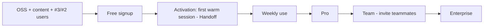

# ContextOS — GO-TO-MARKET

> The acquisition, activation, retention, and expansion engine. Pairs with [SALES.md](./SALES.md) (sizing/funnel/fundraising) and [PRICING.md](./PRICING.md) (economics). Motion: developer-led, build-in-public, open-core PLG.

## 1. Executive Summary

ContextOS's go-to-market is **product-led growth (PLG)**: developers adopt the free Context Handoff, the product itself drives acquisition (OSS + content + virality), teams convert on collaboration/governance, and enterprises are sold on security/compliance. Acquisition is **low-cash** (build-in-public, open-source, content/SEO, community) and amplified by the **funnel from the wedge products** (#3 MCP Generator, #2 Codebase Intelligence) — every generated server and indexed repo is a ContextOS lead. The north-star **activation metric is time-to-first-warm-session** (export context → a fresh AI session uses it), optimized to under 10 minutes. Retention is structurally strong because **switching cost compounds with accumulated context**, and growth compounds via **expansion** (seats + usage + tier), targeting net revenue retention above 110%. This document details the channels (ranked by leverage for a solo dev-founder), the funnel and its metrics, the launch plan, and the retention/expansion strategy.

---

## 2. Positioning

> **"Team memory and governance for AI-assisted engineering."** Your AI tools forget; ContextOS remembers — across sessions, tools, and teammates — and gives you control over everything the AI does.

Category framing: the **context/control layer** for AI dev tooling — tool-agnostic, not another IDE, not another model. This neutrality is the wedge (see [VISION.md](./VISION.md)).

---

## 3. Channels (ranked by leverage for a solo dev-founder)

1. **Build in public** — the MERN→AI founder story + shipping updates/metrics on X/LinkedIn. Authentic, compounding, near-zero cash.
2. **Open source** — the Context Handoff format + CLI + chunker on GitHub → stars, trust, contributors, top-of-funnel (D-007, [OPEN_SOURCE.md](./OPEN_SOURCE.md)).
3. **Content / SEO** — deep posts that rank and convert developers: "stop losing context between AI sessions," "RAG over your codebase," "governing AI in your eng org," "CLAUDE.md at team scale."
4. **Product Hunt + Hacker News + Reddit** (r/programming, r/devtools, r/ExperiencedDevs) — launch spikes; the Handoff demo is HN-friendly.
5. **YouTube / short-form** — demos of the "warm-start AI session" wow.
6. **Community** — own a Discord/Slack around AI-engineering reliability/context.
7. **Newsletter** — capture an email list from day one.
8. **Partnerships** — Claude/Cursor MCP directories, accelerators (YC), agencies.
9. **Wedge funnel** — every MCP server generated (#3) and repo indexed (#2) → nurture toward ContextOS.

The channel strategy is deliberately **content/community/OSS-heavy** because it yields low CAC and durable authority, which is the right profile for a capital-efficient, bootstrap-to-seed company.

---

## 4. The Funnel

| Stage | Metric | Target |
|-------|--------|--------|
| Acquisition | signups, OSS stars, content→signup, PH/HN spikes | growth MoM |
| **Activation** | **time-to-first-warm-session**; % activated | < 10 min; > 40% of signups |
| Retention | week-4 retention; WAU/MAU | week-4 > 40%; healthy curve flattening |
| Monetization | free→paid conversion; MRR | 3–8% free→paid |
| Expansion | NRR; seats/account; usage | NRR > 110% |

**Activation is the obsession.** The single most important leading indicator is whether a new user experiences the warm-start "aha" fast. Onboarding is engineered to deliver it in minutes (Sprint 6 in [SPRINTS.md](./SPRINTS.md)).

---

## 5. Customer Acquisition Strategy (CAC)
- **Primary:** content + OSS + build-in-public + community → low-cash, compounding, high-trust. CAC is mostly founder *time* early.
- **Viral:** product-led — in-product team invites; sharing context bundles; the Handoff naturally spreads tool-to-tool and teammate-to-teammate.
- **Funnel reuse:** the #2/#3 audiences are pre-qualified ContextOS prospects (huge CAC advantage).
- **Paid:** minimal pre-scale; consider targeted paid only after a proven self-serve conversion engine exists. Target **CAC payback < 12 months**, far faster for self-serve Team ([PRICING.md §4](./PRICING.md)).

## 6. Retention Strategy
- **Structural:** switching cost compounds — the longer a team uses ContextOS, the richer (and more load-bearing) its context store. Removing it = team amnesia.
- **Behavioral:** weekly habit via the Handoff (used every session) + dashboards (eng lead checks spend/quality).
- **Quality:** evals + grounding keep answers trustworthy; a single confident wrong answer is a churn risk, so quality is a retention investment.
- **Measure:** week-4 cohort retention is the real PMF signal; instrument it from launch.

## 7. Expansion Revenue Strategy
- **Seats:** land 3–5 devs → expand to the whole team (bottom-up adoption).
- **Usage:** metered overage above credits as AI usage grows.
- **Tier:** Pro→Team (collaboration/governance), Team→Enterprise (security/compliance).
- **Modules:** agents, integrations, observability as the platform matures.
Expansion is cheaper than new-logo acquisition and drives the NRR>110% target — the compounding-revenue engine.

## 8. Launch Plan
- **Pre-launch:** build-in-public through the whole 12-week MVP; grow waitlist + newsletter; OSS the Handoff CLI early for stars.
- **Private beta:** 20 design-partner teams (from #2/#3 audience); weekly feedback; case studies.
- **Public launch:** Product Hunt + HN + a flagship blog post + the Handoff demo video, coordinated with design-partner testimonials.

## 9. Content Pillars
1. Context engineering & reliability for AI coding.
2. RAG-over-code deep dives (technical authority).
3. Governing AI in engineering orgs (for eng leads/buyers).
4. The founder journey (MERN→AI; build-in-public).

## 10. Enterprise GTM (Year 2+)
Inbound-led (large logos pull) → founder-led sales → founding sales hire. Land-and-expand; security one-pager + SOC 2 + on-prem unlock the segment. Detail in [SALES.md §4](./SALES.md).

## 11. Tradeoffs, Risks, Alternatives
- **Tradeoff — content/OSS (slow, compounding) vs. paid (fast, expensive):** we choose compounding low-CAC channels for capital efficiency; paid only after conversion is proven.
- **Risk — activation fails (users don't reach the wow):** mitigated by obsessive onboarding optimization toward time-to-first-warm-session.
- **Risk — vanity metrics (stars/followers) mistaken for traction:** the only PMF signals are retention and paid conversion; we track those, not applause (FOUNDERS_NOTES.md).
- **Alternative rejected — outbound-sales-first:** wrong for a dev-tools wedge; PLG first.

## 12. Future Considerations
A formal developer-advocacy/DevRel function (high leverage for dev tools) at ~$25–50K MRR; community-led growth (a thriving Discord); partner/channel motion via IDE and model ecosystems; an affiliate/referral program once virality is measured.

## 13. Related Documents
[SALES.md](./SALES.md) · [PRICING.md](./PRICING.md) · [CUSTOMERS.md](./CUSTOMERS.md) · [OPEN_SOURCE.md](./OPEN_SOURCE.md) · BUSINESS_STRATEGY.md

*Last reviewed 2026-06-19.*
