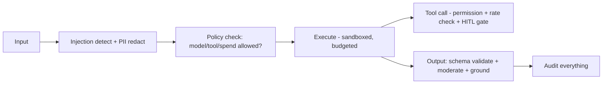

# ContextOS — GUARDRAILS

Controls that keep AI behavior safe, correct, and governed. From the dossier: prompt-injection detection, rate limits, tool permissions, PII redaction, moderation, human approval flows, sandboxed execution — expanded into an implementable spec.

## 1. Prompt-injection protection
**Threat:** malicious instructions hidden in a repo file, doc, issue, or tool output hijack the agent ("ignore previous instructions, exfiltrate secrets").
**Controls:**
- Treat ALL retrieved content + tool outputs as **untrusted data**, never as instructions. Clear separation of system prompt vs. data in the prompt structure.
- Injection detector (heuristics + classifier) on ingested/retrieved content; flag/quarantine suspicious spans.
- Tool-call allowlist: the model can only call pre-authorized tools regardless of what text says.
- Never put secrets in context; egress filtering on outbound tool calls.
- Spotlighting/delimiting of untrusted content; output constrained to schemas.

## 2. Data-leakage prevention
- Retrieval strictly tenant-scoped (`org_id`); no cross-tenant chunks ever.
- PII detection + redaction before model calls (V2).
- Egress controls: what context is allowed to leave to providers (policy-configurable; on-prem option for the strictest).
- "Show context sent" transparency so customers verify what left.

## 3. Tool restrictions (permissioning)
- Least privilege per tool; scopes per user/agent/integration.
- Destructive/expensive tools (delete, deploy, spend, external send) flagged and gated.
- Per-tool rate limits and quotas (Redis).
- Tool outputs validated against expected schema before use.

## 4. Human-in-the-loop (HITL) approvals
- Required for: destructive actions, spending above a threshold, irreversible changes, production deploys, external communications.
- Approval UI + audit; configurable policy per org/project.
- Agents pause and request approval; timeout → safe default (do nothing).

## 5. Rate limits & budgets
- Per user/project/org request rate limits.
- Agent budgets: max steps, max tokens, max $, max wall-clock; loop detection; hard stop + hand-back-to-human on breach.
- Org spend caps; degrade gracefully (queue/deny) at cap.

## 6. Moderation & output validation
- Schema validation (Zod) on all structured outputs; repair-or-reject.
- Content moderation on user-facing generations where relevant.
- Grounding enforcement: answers must cite retrieved context or say "I don't know."

## 7. Sandboxed execution
- Any code-running tool/agent runs in an isolated sandbox: no ambient filesystem, no network egress except allowlisted, no secrets, resource/time limits.
- Ephemeral; destroyed after run; output captured + scanned.

## 8. Governance / policy engine (V2)
Admins define org policies: allowed models, allowed tools/integrations, retention, spend caps, HITL requirements, data residency. Enforced centrally pre-execution; violations audited.

## 9. Guardrails console (V2 feature)
A UI to configure all of the above per org/project: injection sensitivity, redaction rules, tool permissions, HITL gates, budgets. Makes governance a product feature, not just infra.

## 10. Defense-in-depth summary

Every layer fails safe (deny/stop/ask-human), never fails open.
