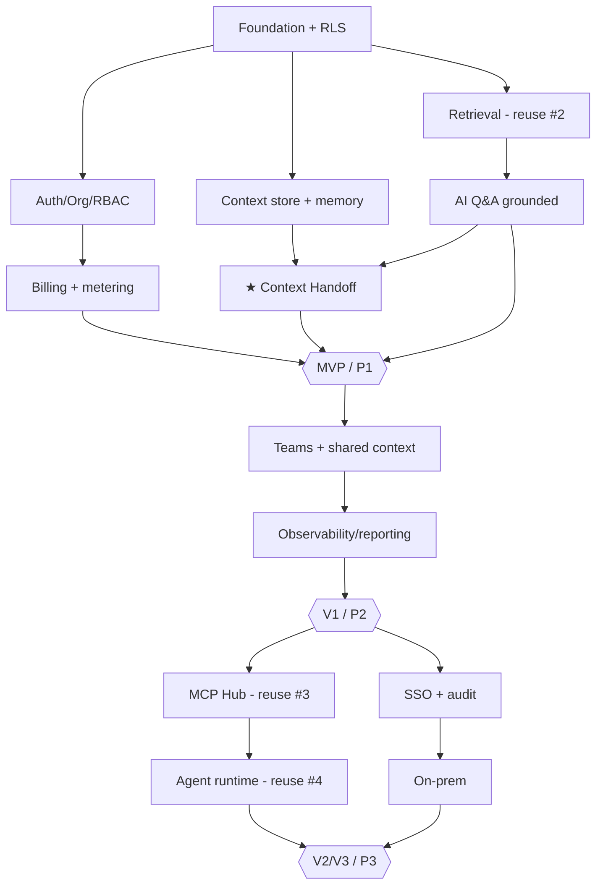

# ContextOS — IMPLEMENTATION ORDER (Phase 2.1, Step 6)

> Every feature ranked **Priority 1 / 2 / 3**, with build order, dependencies, risk, complexity, and expected business impact. This is the prioritization layer between [FEATURES.md](./FEATURES.md) (what) and [SPRINTS.md](./SPRINTS.md)/[TASKS.md](./TASKS.md) (when/how). The ranking method and the single rule that governs it are stated first, because *the order matters more than the list*.

## 0. Method & The One Rule

**Ranking method** — each feature scored on four axes:
- **Business impact** (does it drive activation, retention, or revenue?) — weighted highest.
- **Dependency** (what must exist first?).
- **Risk** (technical + adoption uncertainty).
- **Complexity** (build effort).

**The one rule:** *ship the wedge that creates the "aha" before anything that merely makes the product "complete."* Activation beats completeness pre-PMF. Concretely: the **Context Handoff** outranks teams, agents, integrations, and polish — even though those feel necessary — because nothing else matters if the wedge doesn't retain ([BUSINESS_VALIDATION.md](./BUSINESS_VALIDATION.md)).

---

## 1. Priority 1 — Build First (MVP; the wedge + the minimum to sell it)

These deliver the "aha" and make it a real, monetizable product. **Nothing in P2/P3 starts until P1 retains.**

| Feature | Why P1 | Depends on | Risk | Complexity | Impact |
|---------|--------|-----------|------|------------|--------|
| Foundation (monorepo, infra, RLS) | everything sits on it | — | Low | Med | Enabling |
| Auth + Org + RBAC scaffold | table stakes; tenant boundary | Foundation | Low | Med | Enabling |
| Billing (Free/Pro) + usage metering + spend caps | monetize + margin control from day one | Auth | Low | Med | Revenue/margin |
| Repo connect + ingestion + **Retrieval (reuse #2)** | grounding engine; the moat | Foundation; **#2 engine** | **High** (reuse risk) | High | Core |
| **AI Q&A grounded + cited + streamed** | makes context useful; trust via citations | Retrieval, LLM abstraction | High (hallucination) | High | Core |
| Context store + memory extraction | the durable asset | Foundation | Med | Med | Core |
| **★ Context Handoff** | **THE wedge / activation "aha"** | Context store, CLI, MCP prompt | Med | Med | **Highest** |
| Cost + basic analytics, "show context sent" | visibility + COGS awareness + trust | metering, OTel | Low | Low | Activation/trust |
| Evals + CI gate | protects quality (= trust = retention) | LLM abstraction | Med | Med | Reliability |

**P1 exit = MVP** (~12 weeks, [SPRINTS.md](./SPRINTS.md)). **Critical-path risk:** the Retrieval/#2 reuse dependency (ADR-033/035) — if #2 isn't ready, P1 slips by ~6 sprints. *De-risk by pinning #2's API or building it first.*

---

## 2. Priority 2 — Build Second (V1; team-ready, the revenue core)

These turn a single-user "aha" into the **Team plan** (where the money is). Built only after P1 retention is proven.

| Feature | Why P2 | Depends on | Risk | Complexity | Impact |
|---------|--------|-----------|------|------------|--------|
| Teams + shared context + invites | unlocks Team plan; bottom-up spread | RBAC, Context store | Low | Med | **Revenue** |
| Collaboration (comments/@mentions/review) | team workflow stickiness | Teams | Low | Med | Retention |
| Observability dashboards + reporting | the eng-lead buying reason | metering, OTel | Low | Med | **Revenue (buyer)** |
| Unified search | daily utility | Retrieval | Low | Med | Engagement |
| Living auto-docs + architecture map (reuse #2) | onboarding ROI proof | #2 engine | Med | Med | Activation/ROI |
| Multi-provider failover + graceful degradation | reliability for paying teams | LLM abstraction | Med | Med | Retention |
| Spend caps + alerts (team-level) | governance the buyer wants | metering | Low | Low | Revenue (buyer) |

**P2 exit = V1 GA / Team plan live.** Impact concentration: the **observability/reporting + teams** combo is what converts the eng-lead buyer — prioritize within P2.

---

## 3. Priority 3 — Build Third (V2/V3; platform + enterprise + ecosystem)

Higher complexity/risk, lower *immediate* impact; they make ContextOS a platform and unlock enterprise — but are premature before V1 retains.

| Feature | Why P3 | Depends on | Risk | Complexity | Impact |
|---------|--------|-----------|------|------------|--------|
| MCP Integration Hub (reuse #3) | platform; integration moat | **#3 engine**, vault | Med | High | Platform/moat |
| Agent runtime + observability (reuse #4) | dynamic tasks; buyer expectation | sandbox (ADR-034), #4 | **High** | High | Differentiator |
| Automation / workflows (triggers) | stickiness; reduces toil | Agent runtime/workflows | Med | Med | Retention |
| Guardrails console + policy engine | enterprise governance | guardrails | Med | High | Enterprise |
| SSO/SAML/SCIM | enterprise gate | Auth | Med | Med | **Enterprise revenue** |
| On-prem/VPC (Helm) | largest deals | K8s path (ADR-024) | High | High | Enterprise revenue |
| Audit exports / SOC 2 evidence | compliance gate | audit log | Low | Med | Enterprise |
| Marketplace hooks (feeds #7) | ecosystem/network effects | #7 | High | High | Long-term moat |

**P3 sequencing within itself:** SSO + audit (cheap enterprise unlocks) before on-prem (expensive); MCP Hub before agents (agents need the integration fabric); marketplace last (needs distribution — built in Year 3 per ROADMAP.md).

---

## 4. Dependency Graph (critical path)

**Three external dependencies dominate the critical path:** #2 (Retrieval, P1), #3 (MCP Hub, P3), #4 (Agent observability, P3). The P1 dependency on #2 is the **highest-leverage risk in the whole plan** — it gates the MVP.

---

## 5. Risk-Adjusted Build Notes
- **Front-load the #2 dependency.** Confirm the Retrieval engine is buildable/importable before committing to the 12-week MVP timeline; otherwise the honest timeline is ~18 weeks (build #2 first).
- **The Handoff is medium-complexity but highest-impact** — do not let it slip behind polish; it is the activation event.
- **Agents (P3) are high-risk** — gate them behind the sandbox decision (ADR-034) and per-agent evals; never ship autonomy before guardrails.
- **Enterprise (P3) is demand-pulled, not calendar-pushed** — build SSO/on-prem when a real deal pulls, not speculatively.

## 6. What to Explicitly NOT Build (anti-scope)
- An editor / code-gen UX (off-strategy, [GAP_ANALYSIS.md](./GAP_ANALYSIS.md)).
- Our own models (D-001/ADR-010).
- The marketplace before distribution exists (premature; Year 3).
- Heavy enterprise features before V1 retains (gold-plating pre-PMF).

## 7. Related Documents
[FEATURES.md](./FEATURES.md) · [TASKS.md](./TASKS.md) · [SPRINTS.md](./SPRINTS.md) · [BUSINESS_VALIDATION.md](./BUSINESS_VALIDATION.md) · [SCALE_ANALYSIS.md](./SCALE_ANALYSIS.md) · [FOUNDER_REVIEW.md](./FOUNDER_REVIEW.md)

*Last reviewed 2026-06-19.*
