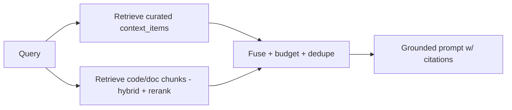

# ContextOS — RAG

ContextOS reuses the Codebase Intelligence (#2) retrieval engine and adds **curated-context** retrieval. See RAG_GUIDE.md for the general method; this doc covers ContextOS specifics.

## Two retrieval sources, fused

1. **Curated context** (`context_items`: decisions, conventions, ADRs, glossary) — high-trust, human/agent-authored. Always given priority in the budget; embedded for semantic match + filtered by type/recency.
2. **Derived context** (code/doc `chunks`) — mechanical RAG-over-code (the #2 engine).

## Chunking
- Code: **AST-aware** (tree-sitter) by function/class/module; metadata `path, symbol, language, start/end line, imports`.
- Docs/ADRs/READMEs: recursive/semantic chunking by headings.
- Oversized functions: overlap-split, keep signature/docstring in each piece.
- Dual embedding (code + NL summary).

## Retrieval
- **Hybrid:** pgvector cosine (HNSW) + Postgres full-text (identifiers/error strings), fused via reciprocal rank fusion.
- **Scope filters:** project, module, language, recency; tenant isolation by `org_id` (mandatory).
- **Symbol-graph expansion** ("graph RAG"): pull callers/callees of matched symbols for cross-file questions.

## Ranking
Cross-encoder / LLM re-rank of ~30–50 candidates → top 5–10 within token budget. Curated context items are boosted (trusted).

## Assembly
Order: curated decisions/conventions → top code chunks (with file:line headers) → working memory. Dedupe; respect budget; cache stable prefix.

## Evaluation
- Golden Q&A over a known repo; metrics: retrieval recall@k/precision@k/MRR; faithfulness; citation correctness; latency p95; cost-per-query.
- LLM-as-judge for faithfulness/relevance; in CI; production sampling grows the dataset.
- Specific ContextOS eval: "does the answer respect approved decisions/conventions?" (consistency with curated context).

## Freshness
GitHub webhook → reindex worker re-embeds only changed files (content-hash); index tied to commit SHA; curated context versioned and stale-flagged.

## Defaults
Same as RAG_GUIDE.md §5: tree-sitter, pgvector+full-text, provider-abstracted embeddings, cross-encoder rerank, agentic RAG (LangGraph) only for multi-hop questions.
